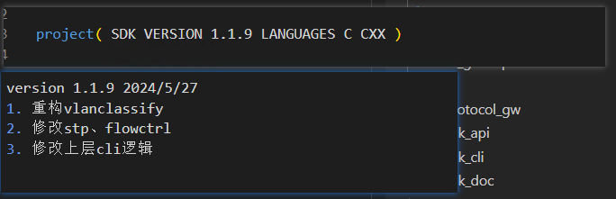

# kg6524出版本

1. 处理代码
- master分支拉最新代码
`git pull`
- 更新update.md与cmakelist.txt用于更新新的版本号

- 提交代码，并打tag上传到远端
```
 git commit "[version][modify]version x.x.x"
 git tag vx.x.x
 git push origin tag vx.x.x
```
- 编译版本
 `vscode: output inner version` or `./build.sh version hengshan`
- 输出cli处理文件
  `vscode: out put cdl include`or`cd script; ./copy_api.sh`

2. 处理输出文档
处理代码输出：`kg6524_vx.x.x.tar.bz2 sdk_api.zip`
- 生成文档(依赖于sdk_api.zip)
  `git pull`
  `./copy_api.sh`

得到版本文件 `kg6524_vx.x.x.tar.bz2 kg_sdk_man.ch kg_sdk_sample.chm`
上传文件到禅道
