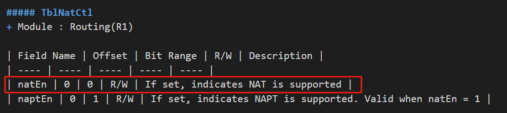

# NAT

[TOC]

## brief

公有IP地址：也叫全局地址，是指合法的IP地址，对外代表一个或多个内部局部地址，是全球统一的可寻址的地址。<br>
私有IP地址：也叫内部地址，属于非注册地址，专门为组织机构内部使用。<br>

| 分类   | 地址段 |
| :----- | :--: |
| A类 |  10.0.0.0 - 10.255.255.255  |
| B类 |  172.16.0.0 - 172.16.255.255  |
| C类 |  192.168.0.0 - 192.168.255.255  |

## Principle of NAT

### address translation

```
NAT的基本工作原理是，当私有网主机和公共网主机通信的IP包经过NAT网关时，将IP包中的源IP或目的IP在私有IP和NAT的公共IP之间进行转换。
```

```
如下图所示，
1.NAT网关有2个网络端口，其中公共网络端口的IP地址是统一分配的公共 IP，为202.20.65.5；
私有网络端口的IP地址是保留地址为192.168.1.1。
2.私有网中的主机192.168.1.2向公共网中的主机202.20.65.4发送了1个IP包(Dst=202.20.65.4,Src=192.168.1.2)。
```

```
1.源IP转换为NAT GW的公共IP并转发到公共网，此时IP包(Dst=202.20.65.4, Src=202.20.65.5)中已经不包含任何私有网IP的信息。
由于IP包的源IP已经被转换成NAT GW的公共IP，Web Server发出的响应IP包(Dst=202.20.65.5, Src=202.20.65.4)将发送到NAT GW。
2.NAT GW会将IP包的目的IP转换成私有网中的主机IP，然后将IP包(Dst=192.168.1.2, Src=202.20.65.4)转发到私有网。
```


### connection tracking
```
在上述过程中，NAT GW在收到响应包后，就需要判断将数据包转发给谁。此时如果子网内仅有少量客户机，可以用静态NAT手工指定；
但如果内网有多台客户机，并且各自访问不同网站，这时候就需要连接跟踪。
```


### port translation
```
以上述客户机访问服务器为例，当仅有一台客户机访问服务器时，NAT GW只需更改数据包的源IP或者目的IP即可正常通讯。
但是如果Client A和Client B同时访问Web Server，那么当NAT GW收到响应包时，就无法判断将数据包转发给那台客户机。
```

```
此时，NAT GW会在Connection Track中加入端口信息加以区分。
如果两客户机访问同一服务器的源端口不同，那么在Track Table里加入端口信息即可区分，如果源端口正好相同，那么在实行SNAT和DNAT的同时对源端口也要做相应的转换。
```


## WAN to LAN


```
1. isLanIf = 0
2. From WAN to LAN, change IPDA, change Layer4 dest port, 公网->私网
```


```
1. 配置TblNatCtl.natEn = 1
2. 入端口的vlan interface isLanIf配置为0
3. ipda match 后出 TblRoute.natEn, TblRoute.natId
```


## LAN to WAN


```
1. isLanIf = 1
2. From LAN to WAN, change IPSA, change Layer4 src port, 私网->公网
```